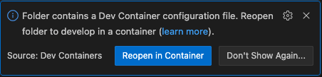

# deeporigin-takehome

# Visit the Preview App on Vercel

You'll need to login to vercel in order to see the app (this is not app login, just vercel allowing u to access the preview)

[vercel preview app](https://deeporigin-takehome-4tawa1x2t-tommy-sullivans-projects.vercel.app/)

NOTE: I didn't add a production app because that would require more effort in order to get the clerk integration for OAuth to work and clerk production mode doesn't support vercel.app domains. I could set it up if need be

NOTE: You will need to use the app level login to get access to signed in features of the URL shortener

# Local Development

Recommend to use VS Code with DevContainers for the easiest setup. There is an alternative manual setup section below if you prefer that.

## Local Development - VS Code with DevContainers

This will automatically build and provision containers for u with a small wrapper around docker-compose, and then drop you in a terminal within the app container, with all of the commands ready to go, no setup needed.

### Devcontainer Extension

If you open in VS Code, due to [vs code extensions](.vscode/extensions.json) it should prompt you, if you don't already have it, to install devcontainer support.

### Open in DevContainer

Given you've got devcontainer extension installed, VS Code should notice the existence of [devcontainer.json](.devcontainer/devcontainer.json) and prompt you with a blue button in the bottom right "Reopen in Container" (see screengrab)

It will automatically:

- build and run a custom postgres image as a container based on postgres.Dockerfile
    - this defines a health check that ensures the database is alive
- build and run a custom app image as a container based on app.Dockerfile
    - the `depends_on` relationship in .devcontainer/docker-compose.yml will cause the app to wait for postgres to be healthy before
- it will subsequently run `npm postCreateCommand` which will do an `npm install` and a `npm run db:setup` to perform the migrations on your behalf, as well as generate typescript types for your database tables

### Start the App

- Run `npm run dev` to bring up the dev server. 
- Click the VS Code prompt with the full url to view in browser. 

NOTE: the URL for the browser will use localhost, which VS Code will automatically map to the underlying container on your behalf. If the default port of 3000 is not available on localhost, it may map to a different port on localhost, tho the container server is always listening on 3000, so best to click the VS code prompt when the server is running to ensure you go to the proper localhost url.

## Local Development - Manual Setup without DevContainers

- run `npm run docker-compose` to set up the compose environment
- run `npm run exec-into-app` to enter a terminal within the app container
- run `npm run postCreateCommand` to install dependencies and run the database migrations and seeding

# Testing

I spent a lot of time manually testing and if this was a real project (or i had more time) i would add automated testing

I usually do end-to-end testing and some unit testing with mocks, and maybe some in-between low-level-integration tests to cover my bases.